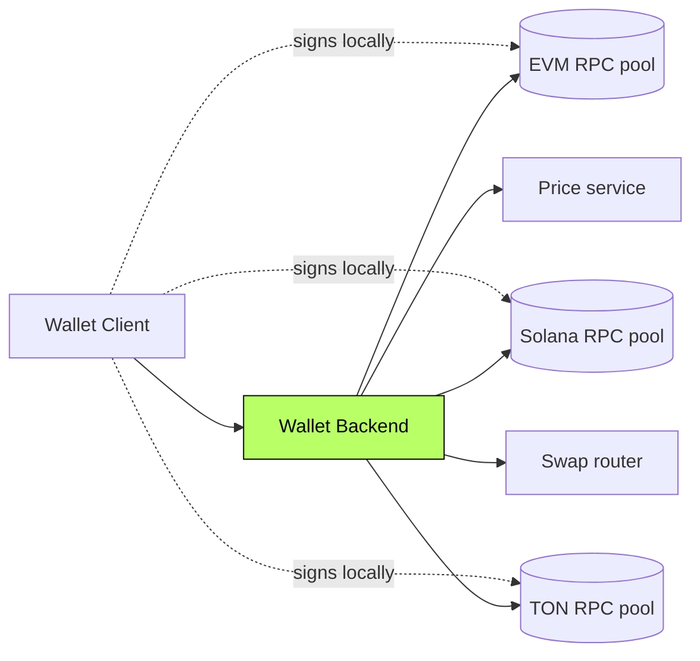

<div align="center">

```
   ██╗    ██╗ █████╗ ██╗     ██╗     ███████╗████████╗
   ██║    ██║██╔══██╗██║     ██║     ██╔════╝╚══██╔══╝
   ██║ █╗ ██║███████║██║     ██║     █████╗     ██║
   ██║███╗██║██╔══██║██║     ██║     ██╔══╝     ██║
   ╚███╔███╔╝██║  ██║███████╗███████╗███████╗   ██║
    ╚══╝╚══╝ ╚═╝  ╚═╝╚══════╝╚══════╝╚══════╝   ╚═╝
```

# Multichain Wallet Stack

#### A Trust Wallet-style multichain wallet — backend and frontend.
#### Keys, balances, transactions across **EVM · Solana · TON.**

[](#)
[](#)
[](#)
[](#)

</div>

---

> **TL;DR** — A multichain wallet stack I built end-to-end. Keys, balances,
> swaps, and history across three chains, with a backend service that powers
> the user surface.

---

## Overview

A self-custodial multichain wallet covering **EVM, Solana, and TON.** The
client manages keys; the backend powers balance aggregation, transaction
history, swap routing, and price data.

Designed for a unified UX over three chains with very different account
models.

> This repository documents the system at the **architectural level**.
> Implementation code is private.

---

## My Role

> **Full-stack Engineer.** Backend services + user-facing client.

- Multichain backend (balance reads, history, swap routing)
- Client architecture and state model
- Wallet integration across three chain SDKs
- Security boundaries — keys never leave the client

---

## Architecture



---

## Capabilities

- **Unified balance view** across three chains
- **Transaction history aggregation**
- **Built-in swap** routed through aggregator
- **Live prices** with degradation policy
- **Key custody on the client** — keys never touch the backend

---

## Architectural Decisions & Tradeoffs

### 1. Backend reads, client signs

The backend never sees a key. It serves **balances, history, quotes**.
The client signs locally. Compromise of the backend cannot move funds.

### 2. Per-chain adapters behind a unified API

The unified API hides the per-chain quirks. Adding a new chain is bounded.

### 3. Price layer has a degradation policy

When the price feed is stale, the UI shows a stale indicator instead of a
confidently-wrong number. Trust over polish.

---

## Engineering Invariants

- **Never** send a key to a server
- **Never** display a stale price as fresh
- **Never** sign without showing the exact effect
- **Never** trust a single RPC for finality

---

## Related Public Documents

- [`multichain-contracts`](https://github.com/eldardzh/multichain-contracts) — contract patterns
- [`weway-launchpad`](https://github.com/eldardzh/weway-launchpad) — adjacent multichain product

---

<div align="center">

#### **Contact**
[**eldardzh.com**](https://eldardzh.com) · [**@EldarDissmay**](https://x.com/EldarDissmay) · **dissmay21@gmail.com**

<sub>© 2026 · Eldar D.</sub>

</div>
